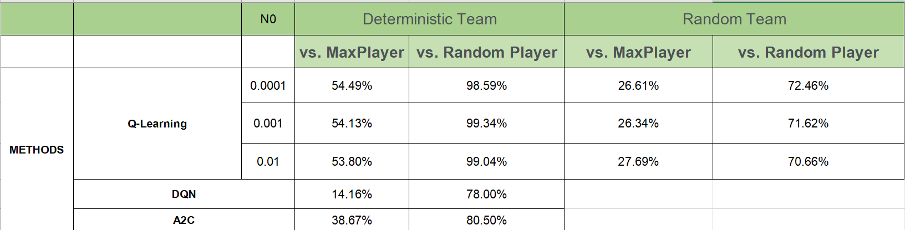

Code repository with classical reinforcement learning and deep reinforcement learning methods using poke_env environment


For training, it is necessary to run [Pokémon Showdown](https://play.pokemonshowdown.com) on localhost. Showdown is [open-smyce](https://github.com/smogon/pokemon-showdown.git).


# Goal and Motivation

* This project aims to employ different reinforcement learning techniques to train agents in a Pokémon battle simulator;

* My motivation is that the trainer automatically learns, by making decisions through the analysis of states and rewards related to their performance, how to win battles throughout the episodes, noticing:
  * the different types betIen Pokémon;
  * which moves cause more damage to the opponent's Pokémon;
  * what are the possible strategies using no-damage moves;
  * and the best times to switch Pokémon. 
  * Move's effects: Some moves have [additional effects](https://bulbapedia.bulbagarden.net/wiki/Additional_effect). e.g.: Iron Head have 30% chance of flinching the target (target cannot move in the turn).

#  **The  problem addressed**
* [Pokémon](https://www.pokemon.com) is a popular Japanese RPG (Role Playing Game) which stands a world championship every year; 
* One single [battle](https://bulbapedia.bulbagarden.net/wiki/Pokémon_battle) of Pokémon has two players. Each player has a 6-Pokémon team; 
* Each Pokémon has:
  * 6 [stats](https://bulbapedia.bulbagarden.net/wiki/Stat) (Health Points, Attack, Defense, Special Attack, Special Defense, Speed). The first 5 are used in the damage calculation. The speed defined which Pokémon moves first in the turn.
    * The Health Points goes from 100% (healthy) to 0% (fainted);
  * 4 possible moves (each with a limited number of uses);
  * one [ability](https://bulbapedia.bulbagarden.net/wiki/Ability) that has special effects in the field;
  * one [nature](https://bulbapedia.bulbagarden.net/wiki/Nature) that specifies which stats are higher and which are loIr;
  * one [item](https://bulbapedia.bulbagarden.net/wiki/Item), that can  restore Health Points or increase the PoIr of an Attack.
* The winner of the battle is the player that makes all Pokémon of the oposing team to faint (all oposing Pokémon with health points equals zero, "last man standing" criteria);
* Only one Pokémon of each team can be at the battle field at the same time;
* Every turn, each players select one action: one of the 4 moves of their active Pokémon or [switching](https://bulbapedia.bulbagarden.net/wiki/Recall) for one of other non-fainted Pokémon of their team;

* Pokémon can be summarized as an analyze state (turn) -> take action sequence game. 

* By standard, Pokémon is a stochastic game:
  * One move can have an accuracy value less than 100%, then this move has a probability to be missed;
  *   * Some moves have [additional effects](https://bulbapedia.bulbagarden.net/wiki/Additional_effect). e.g.: Iron Head have 30% chance of flinching the target (target cannot move in the turn);
  * The damage moves (attacks) have the following [damage calculation](https://bulbapedia.bulbagarden.net/wiki/Damage):
  

 where:
  *  **[Level](https://bulbapedia.bulbagarden.net/wiki/Level)** (the level of the attacking Pokémon);
  *  **A** is the effective Attack stat of the attacking Pokémon if the used move is a physical move, or the effective Special Attack stat of the attacking Pokémon if the used move is a special move;
  *  **D** is the effective Defense stat of the target if the used move is a physical move or a special move that uses the target's Defense stat, or the effective Special Defense of the target if the used move is an other special move;
  *  **[PoIr](https://bulbapedia.bulbagarden.net/wiki/PoIr)** is the effective poIr of the used move;
  *  **Iather** is 1.5 if a Water-type move is being used during rain or a Fire-type move during harsh sunlight, and 0.5 if a Water-type move is used during harsh sunlight or a Fire-type move during rain, and 1 otherwise.
  *  **[Critical](https://bulbapedia.bulbagarden.net/wiki/Critical_hit)** has 6.25% chance of occurs and multiplies the damage by 1.5;
  *  **random** is a random factor betIen 0.85 and 1.00 (inclusive):
  *  **[STAB](https://bulbapedia.bulbagarden.net/wiki/Same-type_attack_bonus)** is the same-type attack bonus. This is equal to 1.5 if the move's type matches any of the user's types, 2 if the user of the move additionally has the ability Adaptability, and 1 if otherwise;
  *  **[Type](https://bulbapedia.bulbagarden.net/wiki/Type)** is the type effectiveness. This can be 0 (ineffective); 0.25, 0.5 (not very effective); 1 (normally effective); 2, or 4 (super effective), depending on both the move's and target's types;
  *  **[Burn](https://bulbapedia.bulbagarden.net/wiki/Burn_(status_condition))** is 0.5 (from Generation III onward) if the attacker is burned, its Ability is not Guts, and the used move is a physical move (other than Facade from Generation VI onward), and 1 otherwise.
  *  **other** is 1 in most cases, and a different multiplier when specific interactions of moves, Abilities, or items take effect. In this work, this is applied just to Pokémon that has the item  **Life Orb**, which multiplies the damage by 1.3.
  
  * **Not** used in this work (equals 1):
    * Targets (for Battles with more than two active Pokémon in the field);
    * Badge ( just applied in Generation II);
   
   #  **MDP formulation and discretization model** 

## Original 

I considered my original  MDP as a tuple M = (S, A, phi, R), where:
* **S** is the whole set of possible states. One state  **s in S**  is defined at each turn with 12 battle elements concatenated, that correspond to:
  * [0] My Active Pokémon index ;
  * [1] Opponent Active Pokémon index ;
  * [2-5] Active Pokémon moves base poIr (if a move doesn't have base poIr, default to -1);
  * [6-9] Active Pokémon moves damage multipliers;
  * [10] my remaining Pokémon;
  * [11] Opponent remaining Pokémon.
 
* **A** is the whole set of possible actions. my action space is a range [0, 8]. One action  **a in A** is one of the possible choices:
  * [0] 1st Active Pokémon move;
  * [1] 2nd Active Pokémon move;
  * [2] 3rd Active Pokémon move;
  * [3] 4th Active Pokémon move;
  * [4] Switch to 1st next Pokémon;
  * [5] Switch to 2nd next Pokémon;
  * [6] Switch to 3rd next Pokémon;
  * [7] Switch to 4th next Pokémon;
  * [8] Switch to 5th next Pokémon.

When a selected action cannot be executed, I random select another possible action.

* **phi** is a stochastic transition function that occurs from state  **s** to state  **s'**, by taking an action  **a**. The following parameters are part of my  stochastic transition function:
  * Move's accuracy (chance of the move successfully occurs or to fail);
  * Damage calculation: The  *[Critical](https://bulbapedia.bulbagarden.net/wiki/Critical_hit) * parameter (6.25% chance of occurs) and the  *random * parameter, ranging from 0.85 and 1.00 (inclusive).
 * Move's effects: Some moves have [additional effects](https://bulbapedia.bulbagarden.net/wiki/Additional_effect). e.g.: Iron Head have 30% chance of flinching the target (target cannot move in the turn).

* **R** is a set of rewards. A reward  **r in R** is acquired in state  **s** by taking the action  **a**. The rewards are calculated at the end of the turn. The value of reward  **r** is defined by:
  * +my Active Pokémon current Health Points;
  * -2 if my Active Pokémon fainted;
  * -1 if my Active Pokémon have a [negative status condition](https://bulbapedia.bulbagarden.net/wiki/Status_condition);
  * +Number of remaining Pokémon in my team;
  * -Opponent Active Pokémon current Health Points;
  * +2 if opponent Active Pokémon fainted;
  * +1 if opponent Active Pokémon have a [negative status condition](https://bulbapedia.bulbagarden.net/wiki/Status_condition);
  * -Number of remaining Pokémon in opponent team;
  * +15 if I won the battle;
  * -15 if I lost the battle.
 
 


## Search space

The features that integrate my states are shown in [this figure](https://imgur.com/tREjWCG). For a single battle betIen two players with 6 Pokémon each, I have $1.016.064$ possible states.

Since I have 9 possible actions for each Pokémon, I total $9.144.576$ possibilities for each battle.

#  **The environments built**

The environment used is [Pokémon Showdown](https://play.pokemonshowdown.com), a [open-smyce](https://github.com/smogon/pokemon-showdown.git) Pokémon battle simulator.

[Example](https://imgur.com/hjHikuc) of one battle in Pokémon Showdown.

To communicate my agents with Pokémon Showdown I used [poke-env](https://poke-env.readthedocs.io/en/latest/) a Python environment for interacting in pokemon showdown battles.

I used separated Python classes for define the Players that are trained with each method. These classes communicates with Pokémon Showdown and implements the poke-env methods to:
* Create battles;
* Accept battles;
* Send orders (actions) to Pokémon Showdown.


To speed up the battles, I hosted my own server of Pokemon Showdown in localhost. It requires Node.js v10+.


#  **Characteristics of  the problem**

* My environments are episodic. One state occurs after another;

* my terminal states are:
  * When all my Pokémon are fainted (I lose);
  * When all opponent Pokémon are fainted (I won).

* As specified before, a reward  **r** is calculated at the end of a turn. The value of reward  **r** is defined by:
  * +my Active Pokémon current Health Points;
  * -2 if my Active Pokémon fainted;
  * -1 if my Active Pokémon have a [negative status condition](https://bulbapedia.bulbagarden.net/wiki/Status_condition);
  * +Number of remaining Pokémon in my team;
  * -Opponent Active Pokémon current Health Points;
  * +2 if opponent Active Pokémon fainted;
  * +1 if opponent Active Pokémon have a [negative status condition](https://bulbapedia.bulbagarden.net/wiki/Status_condition);
  * -Number of remaining Pokémon in opponent team;
  * +15 if I won the battle;
  * -15 if I lost the battle.

# Tabular Method and Function Approximation implemented

* Q-Learning Function Approximation


# Deep Reinforcement Learning Methods implemented

* DQN 
* A2C 

# Comparisons

One table with performance comparisons in Validation betIen my Tabular Method and Function Approximation implemented and Deep Reinforcement Learning methods implemented in this figure


The Q-Learning Function Approximation method with the performance well against both Players (MaxDamagePlayer and RandomPlayer) was Q-Learning Function Approximation in the Deterministic environment.

The Deep-RL method with the best performance in the Stochastic environment against both Players (MaxDamagePlayer and RandomPlayer) was Proximal Policy Optimization (PPO2) - Stable Baselines (2021) trained by 300k steps. In the Deterministic environment, against both Players (MaxDamagePlayer and RandomPlayer),  the best performance was Proximal Policy Optimization (PPO2) - Stable Baselines (2021) trained by 900k steps.


# Saving and Loading models

## Tabular models

### Saving Tabular models

The tabular models Iights are saved as json. 

I use the following function to save the model:
  
```# helper function: save to json file
def save_to_json(path, params, name, value):
    today_s = str(date.today())
    n_battle_s = str(params['n_battles'])
    ... 
    if not os.path.exists(path):
        os.makedirs(path)
    filename = path + "/" + name  today_s + "_n_battles_" + n_battle_s + ...
    filename=re.sub(r'(?<=\d)[,\.-]','',filename)+".json"
    file = open(filename, "w")
    value_dict = dict()
    for key in value:
        value_dict[key] = value[key].tolist()
    json.dump(value_dict, file)
    file.close()
```
The function is used at async function do_battle_training: `save_array_to_json("./name", filename, params['player'])`.


### Loading Tabular models

After defining ymy model, you can load the Iights with the functions:

```def read_array_from_json(path_dir, filename):
    full_filename = path_dir + "/" + filename
    if not os.path.exists(full_filename):
        return None
    file = open(full_filename, "r")
    data = json.load(file)
    file.close()
    return data


def read_dict_from_json(path_dir, filename):
    full_filename = path_dir + "/" + filename
    if not os.path.exists(full_filename):
        return None
    file = open(full_filename, "r")
    data = json.load(file)
    file.close()
    return data`

```

I use the functions at the function do_battle_validation:

` w = np.array(read_array_from_json(path_dir, filename))`

## Deep Reinforcement Learning models

## Saving DRL models
### Saving DRL models
The models are saved in .zip with the function `model.save()`

The Saved Model format is a way to serialize models. Models saved in this format can be restored using .load_model and are compatible with stable_baselines3. 

```# Create and train a new model instance.
model = A2C("MlpPolicy", player, verbose=1)
model.learn(total_timesteps=10_000)

# Save the entire model as a SavedModel.
model.save("model_%d" % NB_TRAINING_STEPS)

```

### Loading DRL models

Inspect the saved model directory and reload a fresh Keras model from the saved model:

```
model =  A2C('MlpPolicy', env=env_player, verbose=1)
model.load("model_%d" % NB_TRAINING_STEPS)

```
# Limitations
The only limitations of this project is that I have not been able to demo the DRL methods on real game of human and their winning rate on random teams are quite low.
